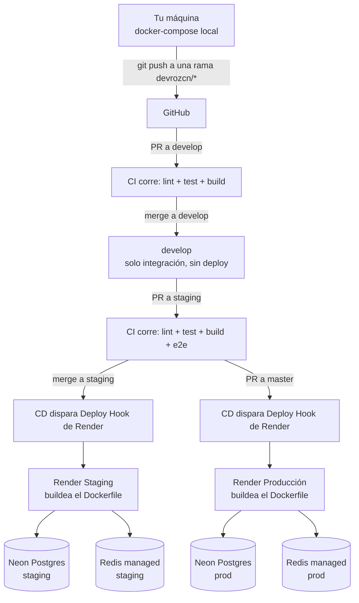

# Docker, CI y CD en Waiona Core — cómo funciona todo esto

Este documento explica, de punta a punta, cómo tu código pasa de tu máquina a producción. La idea es que lo puedas leer sin tener que ir a googlear términos ni adivinar qué hace cada pieza.

---

## 1. Panorama general



**Los 4 sistemas separados que tenés que tener en la cabeza:**

1. **Docker** (`Dockerfile`, `docker-compose.yaml`) — define cómo se empaqueta la app. Vive en tu repo.
2. **CI** (`.github/workflows/ci.yml`) — corre en GitHub Actions, valida que el código esté bien (lint, tests, build). No toca ningún servidor real.
3. **CD** (`.github/workflows/cd.yml`) — corre en GitHub Actions, pero lo único que hace es avisarle a Render "arrancá un deploy". No buildea nada él mismo.
4. **Render** — la plataforma donde vive tu API. Es quien realmente clona el repo, buildea el `Dockerfile` y levanta el contenedor. Su configuración vive en un dashboard web, **no en este repo**.

---

## 2. Docker

### 2.1 `Dockerfile` — cómo se arma la imagen

Usa **multistage build**: dos etapas, la primera compila, la segunda es la que realmente corre.

```dockerfile
# STAGE 1: Builder
FROM node:24.18.0-alpine AS builder
WORKDIR /app
COPY package*.json ./
RUN npm ci                # instala TODO (incluye devDependencies, hace falta para compilar)
COPY . .
RUN npm run build          # genera /app/dist

# STAGE 2: Runner
FROM node:24.18.0-alpine AS runner
WORKDIR /app
ENV NODE_ENV=production
COPY package*.json ./
RUN npm ci --omit=dev      # instala SOLO dependencias de producción, en una imagen nueva y limpia
COPY --from=builder /app/dist ./dist       # trae solo el resultado compilado del builder
COPY --from=builder /app/public ./public
COPY entrypoint.sh ./
RUN chmod +x entrypoint.sh
EXPOSE 3000
ENTRYPOINT ["./entrypoint.sh"]
```

**Por qué dos etapas:** la etapa `builder` necesita el compilador de TypeScript y todas las devDependencies, que pesan mucho y no sirven en producción. La etapa `runner` arranca de cero (`FROM node:...alpine` de nuevo) y solo copia el resultado ya compilado (`dist/`) — así la imagen final no carga con basura de build.

**Por qué `alpine`:** es una versión de Linux mínima (~5MB vs. ~70MB de Ubuntu). Menos peso, menos superficie de ataque.

**Lo que falta acá (ver sección 7):** el contenedor corre como `root` por default — no hay una línea `USER` que lo baje a un usuario sin privilegios.

### 2.2 `docker-compose.yaml` — SOLO para tu máquina

Este archivo **nunca se usa en Render**. Es exclusivamente para que puedas levantar todo el stack en tu compu:

| Servicio | Para qué |
|---|---|
| `postgres` | tu DB local de desarrollo |
| `postgres_test` | DB separada para correr tests localmente |
| `redis` | cache/colas local |
| `pgadmin` | interfaz visual para inspeccionar la DB (puerto 5050) |
| `api` | tu app, buildeada desde el mismo `Dockerfile` de arriba |

En producción y staging, Postgres es **Neon** (managed) y Redis es otro proveedor managed — ninguno de los dos es un contenedor tuyo. Este compose no tiene relación con lo que corre en Render.

### 2.3 `entrypoint.sh` — qué hace el contenedor al arrancar

```sh
#!/bin/sh
set -e
echo "Running database migrations..."
node node_modules/.bin/typeorm migration:run -d dist/database/ormconfig.js
echo "Starting application..."
exec node dist/main
```

Esto corre **cada vez que arranca el contenedor**, tanto en Render como si lo corrés local. Primero corre las migraciones pendientes de TypeORM, después arranca la app. Ver sección 7 sobre por qué esto no es ideal.

### 2.4 `.dockerignore`

Evita copiar `node_modules`, `.git`, `coverage`, archivos `.env`, etc. dentro de la imagen — reduce peso y evita filtrar secretos.

---

## 3. CI (`.github/workflows/ci.yml`)

Corre automáticamente en **cada push o PR** a `master`, `staging` o `develop`. Tiene 4 jobs:

| Job | Qué hace | Cuándo corre |
|---|---|---|
| `lint` | `eslint` sobre todo el código | siempre |
| `test-unit` | `npm test` (tests unitarios con mocks) | siempre |
| `build` | `npm run build` (compila TypeScript) | siempre |
| `test-e2e` | tests end-to-end contra Postgres/Redis reales | **solo** si el push/PR es a `staging` o `master` |

**El dato importante:** `test-e2e` levanta sus propios contenedores de Postgres y Redis usando la función nativa de GitHub Actions (`services:`), efímeros, que se destruyen al terminar el job. **No usa ni tu `Dockerfile` ni tu `docker-compose.yaml`.**

**Gap:** en ningún job de este archivo se ejecuta `docker build .`. Es decir, **tu `Dockerfile` nunca se valida en CI** — la primera vez que alguien sabe si el build de Docker funciona es cuando Render intenta deployarlo.

---

## 4. CD (`.github/workflows/cd.yml`)

```yaml
deploy-staging:
  if: rama == staging Y CI pasó con éxito
  run: curl -f -X POST "$RENDER_STAGING_DEPLOY_HOOK_URL"

deploy-production:
  if: rama == master Y CI pasó con éxito
  run: curl -f -X POST "$RENDER_DEPLOY_HOOK_URL"
```

**Qué es un "Deploy Hook":** una URL secreta única por servicio de Render. Pegarle un `POST` (el contenido del request no importa, Render lo ignora) le dice a Render "arrancá un deploy nuevo ahora mismo" para ese servicio puntual, usando el último commit disponible en la rama que ese servicio tiene configurada.

**Por qué existe este paso** (en vez de dejar que Render deploye solo con cada push, que es su comportamiento por default): confirmado en el dashboard, **`Auto-Deploy: Off`** en ambos servicios. Esto significa que el *único* camino para que algo llegue a producción es que CI pase en verde y este workflow le pegue al hook. Es una decisión correcta — evita que algo con tests rotos llegue a producción por accidente.

---

## 5. Render (staging y producción)

Son **dos servicios distintos** dentro de Render, cada uno con su propio Deploy Hook, cada uno apuntando a una rama distinta del mismo repo de GitHub.

### 5.1 Configuración confirmada (screenshot de staging — producción está configurada igual)

| Campo | Valor | Nota |
|---|---|---|
| Source | `github.com/waiona-ecommerce/waiona-core` | |
| Branch | `staging` (en prod: `master`) | |
| Dockerfile Path | `./Dockerfile` | |
| Docker Build Context | `.` | |
| Docker Command | *(vacío)* | usa el `ENTRYPOINT` del Dockerfile tal cual |
| **Pre-Deploy Command** | **(vacío)** | ⚠️ ver sección 7 — acá deberían ir las migraciones |
| Auto-Deploy | **Off** | el único disparador es el Deploy Hook vía CD |
| Health Check Path | `/health` | Render hace polling a este endpoint antes de cortar tráfico al deploy viejo |
| Git Credentials | tu usuario personal de GitHub | ver sección 7 |

### 5.2 Dónde viven las variables de entorno reales

**No están en este repo.** Cada servicio de Render tiene su propia sección "Environment" en el dashboard, con sus propias variables (conexión a Neon, a Redis, `JWT_SECRET`, credenciales de MercadoPago, etc.), completamente separadas entre staging y producción. Nada de eso está versionado en ningún lado fuera del dashboard de Render.

---

## 6. Los 4 ambientes, de punta a punta

| Ambiente | Dónde corre | DB | Redis | Quién dispara el deploy |
|---|---|---|---|---|
| **Local (dev)** | tu máquina, `docker-compose up` | contenedor propio | contenedor propio | vos, manualmente |
| **`develop` (integración)** | no corre en ningún lado | — | — | nadie — solo corre CI (lint/test/build), sin `test-e2e` y sin CD |
| **`staging`** | Render (servicio "staging") | Neon (instancia staging) | managed (staging) | CD, automático tras CI verde en `staging` |
| **`master` (producción)** | Render (servicio producción) | Neon (instancia prod) | managed (prod) | CD, automático tras CI verde en `master` |

---

## 7. Gaps conocidos (para ir arreglando de a uno, sin romper nada)

Ordenados por impacto / facilidad, no por urgencia crítica — nada de esto es un incendio activo:

1. **Migraciones en el `entrypoint.sh` en vez de `Pre-Deploy Command`.** Hoy la migración corre pegada al arranque de la app, dentro del mismo proceso. Render tiene un campo dedicado (`Pre-Deploy Command`, hoy vacío) pensado exactamente para esto. Es un cambio de configuración en el dashboard, no de código — bajo riesgo, alto impacto (evita que N réplicas futuras corran migraciones en paralelo).
2. **Usuario `root` en el `Dockerfile`.** Falta una línea `USER node` en el stage `runner`. Cambio de una línea, pero hay que probarlo en staging primero por si algo asume permisos de root (poco probable, pero se prueba antes de tocar producción).
3. **El `Dockerfile` nunca se buildea en CI.** Agregar un job que corra `docker build .` en cada PR evitaría descubrir un build roto recién en el deploy.
4. **Sin scanning de imágenes** (Trivy u otro) en CI — detectaría vulnerabilidades conocidas en las dependencias del sistema operativo de la imagen.
5. **Configuración de Render no versionada (sin Infra-as-Code).** Todo lo de la sección 5.1 vive solo en el dashboard. Si se pierde acceso o se borra sin querer, no hay forma de reconstruirlo leyendo el repo.
6. **Git Credentials del build atado a una cuenta personal**, no a una cuenta de servicio de la organización — riesgo bajo pero real si esa cuenta pierde acceso al repo.

---

## 8. Glosario rápido

- **Multistage build:** un `Dockerfile` con varias etapas (`FROM ... AS nombre`), donde etapas posteriores copian solo lo que necesitan de las anteriores, dejando afuera herramientas de compilación que no hacen falta en el resultado final.
- **Deploy Hook:** URL secreta que, al recibir un `POST`, le dice a una plataforma (Render) "deployá ahora". No lleva información en el body, es solo un disparador.
- **Health Check:** endpoint (acá `/health`) que la plataforma consulta periódicamente para saber si el servicio está sano, antes de enrutarle tráfico real.
- **Pre-Deploy Command:** comando que Render corre *antes* de arrancar el proceso principal del contenedor, pensado para tareas de un solo disparo como migraciones — separado del comando de arranque normal.
- **Auto-Deploy:** comportamiento default de Render de deployar automáticamente con cada push a la rama configurada, sin intervención externa. Acá está desactivado a propósito.
